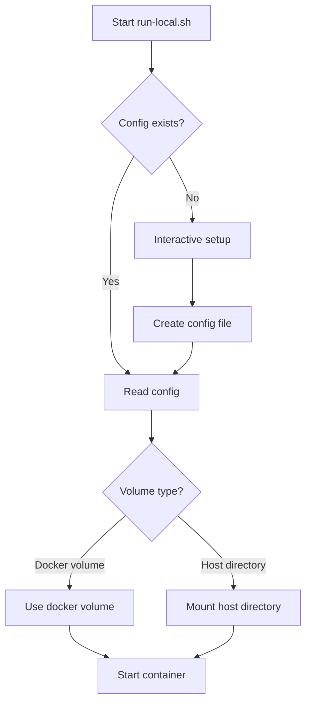
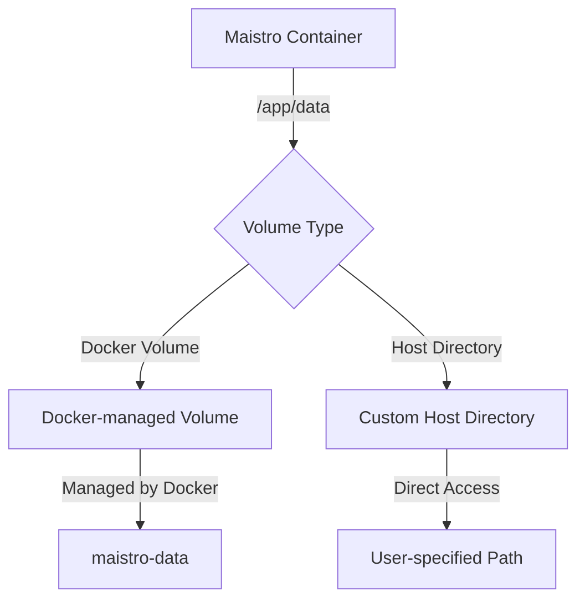

# Maistro

A web-based automation tool for orchestrating and scheduling sequences of LLM interactions through the Goose CLI tool, with support for MCP server extensions.

## Overview

Maistro allows you to:
- Define multiple prompts (saved as individual .md files)
- Execute them in order, waiting for each response
- Schedule these "runs" ahead of time (via crontab)
- Configure and use MCP servers for extended functionality

Each configuration allows you to define:
- A name for the configuration
- Any number of prompts in sequence
- MCP server extensions for each prompt
- A schedule (daily, weekly, or monthly)

## Prerequisites

- Node.js and npm
- [Goose CLI tool](https://github.com/xyzabc/goose) (confirmed to work with v1.0.7+)
- Access to system crontab (for scheduling)
- Docker and Docker Compose (for containerized deployment)

## Installation

### Standard Installation

1. Clone this repository:
```bash
git clone https://github.com/yourusername/maistro.git
cd maistro
```

2. Install dependencies:
```bash
npm install
```

3. Start the application:
```bash
npm start
```

4. Open your browser to http://localhost:3000

### Docker Installation

1. Clone this repository:
```bash
git clone https://github.com/yourusername/maistro.git
cd maistro
```

2. Build and run using Docker Compose:
```bash
# Build the Docker image for your current platform
./scripts/build-local.sh

# Start the container (with interactive configuration)
./scripts/run-local.sh

# Or run in detached mode
./scripts/run-local.sh --detached
```

3. Open your browser to http://localhost:3000

#### Docker Volume Configuration

When you run Maistro for the first time using `run-local.sh`, you'll be guided through a configuration process:



You can choose between two options for data persistence:

1. **Docker-managed volume** (default):
   - Easier to manage
   - Data is managed by Docker
   - Ideal for most users

2. **Custom host directory**:
   - Mount a specific directory from your host system
   - Direct access to configuration files
   - Useful for advanced users or for sharing configurations

Your choice is saved in a `.maistro-docker-config` file for future runs.

#### Additional Run Options

```bash
# Skip configuration prompts (use existing or default)
./scripts/run-local.sh --skip-config

# Reset configuration and prompt again
./scripts/run-local.sh --reset-config

# Show help and all available options
./scripts/run-local.sh --help
```

#### Docker Build Options

The Docker build supports both ARM64 and AMD64 architectures:

```bash
# Build the Docker image for your current platform
./scripts/build-local.sh

# Build with verbose output
./scripts/build-local.sh --verbose

# Build for a specific platform
./scripts/build-local.sh --platform="linux/amd64"

# Build for multiple architectures (requires Docker registry setup)
./scripts/build-local.sh --multi-arch
```

By default, the build script will detect your current platform and build only for that architecture. Use the `--multi-arch` flag to build for both ARM64 and AMD64 architectures simultaneously.

## Usage

### Creating a Configuration

1. Click "+ New Configuration"
2. Enter a name
3. Add prompts using the "Add Prompt" button
4. For each prompt, select an optional model or use the default one
5. Optionally configure a schedule
6. Click "Save"

### Running a Configuration

1. Select a configuration from the list
2. Click "Run Now" in the execution panel
3. View real-time output in the terminal window

### Scheduling a Configuration

1. Select a configuration
2. Enable scheduling
3. Choose frequency (daily, weekly, monthly)
4. Set the time and day(s) as needed
5. Save the configuration

### Configuring LLM Models

Maistro allows you to specify which LLM model should process each prompt:

1. Navigate to the "Models" tab
2. Enter your OpenRouter API key
3. Set a default model
4. Add or remove models as needed
5. When creating prompts, you can select a specific model for each prompt or use the default

Out of the box models include:
- anthropic/claude-3.7-sonnet:thinking
- anthropic/claude-3.7-sonnet
- openai/o3-mini-high
- openai/gpt-4o-2024-11-20

You can add any model supported by OpenRouter.

#### How Model Switching Works

Maistro uses a sophisticated approach to model switching that preserves session context:

1. **Initial Setup**: Configure your OpenRouter API key once through the Models tab.

2. **Per-prompt Model Selection**: Each prompt in a configuration can use either:
   - The default model (configured in Models tab)
   - A specific model chosen from the dropdown in the prompt editor

3. **Dynamic Model Switching**: When executing a configuration with multiple prompts:
   - Maistro automatically updates the Goose configuration file before each prompt
   - For the first prompt, Maistro starts a new session with the appropriate model
   - For subsequent prompts, Maistro uses the `--resume` flag to maintain context
   - This allows switching models mid-conversation while preserving context

4. **Technical Implementation**:
   - Maistro directly updates the `GOOSE_MODEL` parameter in the Goose YAML config
   - This approach is more reliable than interactive configuration
   - All API keys and models are stored securely in the Maistro data directory

This implementation allows for sophisticated workflows where different prompts can leverage the strengths of different models while maintaining a coherent conversation throughout the execution.

### Using MCP Server Extensions

[Model Context Protocol (MCP)](https://github.com/anthropics/anthropic-tools/tree/main/model-context-protocol) servers enable LLMs to interact with external systems and APIs. Maistro allows you to:

1. **Configure MCP Servers**:
   - Navigate to the "MCP Servers" tab
   - Click "+ New MCP Server"
   - Enter the server details:
     - Name: A descriptive name for the server
     - Command: The executable (e.g., `node`)
     - Arguments: The script path (e.g., `/path/to/server.js`)
     - Environment Variables: Any required API keys or configuration
   - Optionally set "Enable by default for new prompts"
   - Save the MCP server configuration

2. **Assign MCP Servers to Prompts**:
   - In the configuration editor, each prompt has an "MCP Servers" button
   - Click this button to open the server selection dialog
   - Check the servers you want to enable for this prompt
   - Click "Apply" to save your selection

When the prompt runs, Maistro will automatically include the selected MCP servers as `--with-extension` parameters to the Goose CLI, giving your prompts access to the tools and resources provided by those servers.

## Technical Details

Maistro uses:
- Node.js with Express for the backend
- WebSockets for real-time execution feedback
- File-based storage for configurations, prompts, and MCP server definitions
- Integration with Goose CLI's extension system for MCP servers
- System crontab for scheduling

### Data Persistence

Maistro stores all its data in the `/app/data` directory inside the container, including:

```
/app/data/
├── configs.json         # All saved configurations
├── mcp-servers.json     # MCP server definitions
├── models.json          # Model settings and API keys
└── prompts/             # Individual prompt files
    ├── config1_prompt_0.md
    ├── config1_prompt_1.md
    └── ...
```

When running with Docker, this data is persisted in one of two ways:



1. **Docker-managed Volume** (default):
   - Data is stored in a Docker volume named `maistro-data`
   - Managed automatically by Docker
   - Persists across container restarts and rebuilds
   - Can be backed up using Docker volume commands

2. **Custom Host Directory**:
   - Data is stored in a directory on your host system
   - Provides direct access to configuration files
   - Easier to back up or version control
   - Can be shared between different installations

The volume configuration is managed by the `run-local.sh` script, which creates a Docker Compose override file based on your preferences.

## License

MIT
